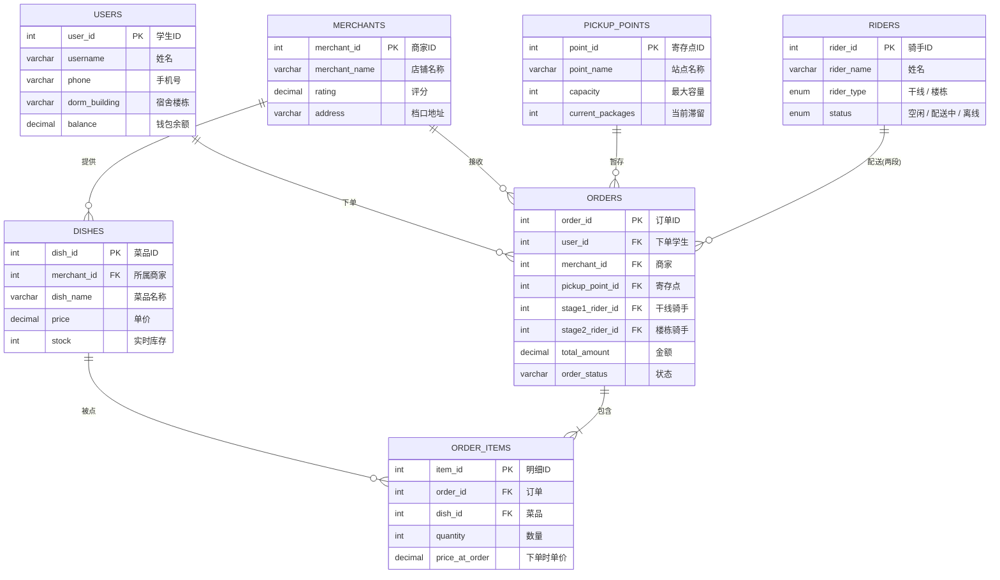
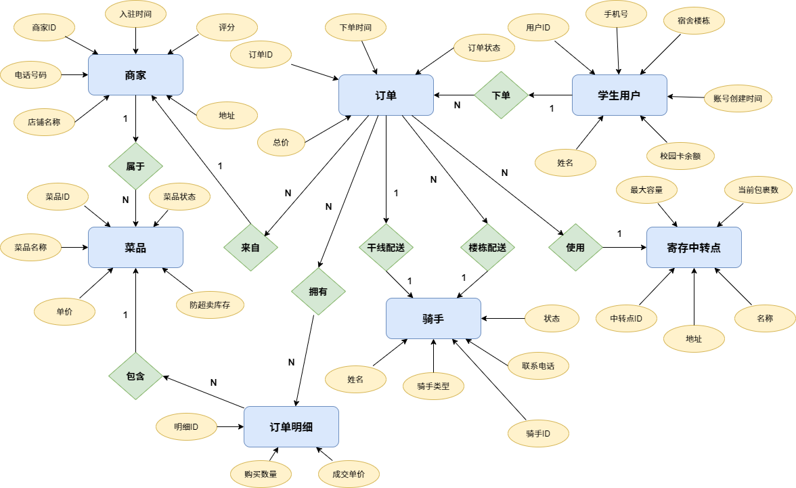

<p align="center">
  
  
  
  
  
  
</p>

<h1 align="center">校园外卖两段式配送数据库系统</h1>

<p align="center">
  <strong>数据库系统项目展示版</strong><br>
  Flask + ECharts + MySQL + DeepSeek AI
</p>

<p align="center">
  
  
  
</p>

---

## 项目概述

传统外卖平台在校园场景面临"最后一百米"困境：校外骑手被宿舍门禁阻挡，学生需下楼取餐——体验差、效率低。本项目设计了一套完整的**两段式配送数据库系统**，将配送拆分为干线运输（商家到寄存点）+ 楼栋配送（寄存点到寝室），通过 MySQL 行级锁、触发器和存储过程保证高并发场景下的数据一致性与库存安全。

系统同时集成了 Flask + ECharts 实时数据监控大屏和 DeepSeek Text-to-SQL 智能查询助手，覆盖从数据库设计、模拟数据生成到可视化运维的完整流程。

---

## 核心功能

**两段式配送模型**——干线骑手负责商家至寄存柜的批量运输，楼栋骑手负责寄存柜至寝室的末端交付。寄存点作为缓冲层解耦两段，干线骑手可一次携带多单，楼栋骑手发挥宿舍布局熟悉的优势。

**高并发防超卖**——`SELECT ... FOR UPDATE` 行级排他锁在事务内保护库存行，配合下单前库存校验触发器和下单后自动扣减触发器，存储过程封装完整事务回滚，确保并发场景下库存安全。

**全生命周期六态状态机**——6 个订单状态覆盖完整链路：`Paid`（已支付） → `Stage1_Assigned`（干线配送中） → `Arrived_At_Point`（已到达寄存点） → `Stage2_Assigned`（楼栋配送中） → `Completed`（已完成），`Cancelled`（已取消）可从任意前序状态触发。

**骑手类型强制约束**——数据库触发器在引擎层强制校验：`stage1_rider_id` 只能指向 `Stage1_Trunk`（干线）骑手，`stage2_rider_id` 只能指向 `Stage2_Floor`（楼栋）骑手。尝试跨类型误派将被 SIGNAL 异常直接阻断。

**骑手状态全自动管理**——骑手状态（`Idle` / `Delivering`）由数据库触发器全自动维护：指派骑手时自动设为 Delivering；对应段完成后自动释放为 Idle（`Arrived_At_Point` → 释放干线骑手，`Completed` → 释放楼栋骑手，`Cancelled` → 释放全部关联骑手）。大屏活跃骑手 KPI 直接 `SELECT COUNT(*) FROM riders WHERE status = 'Delivering'`，精准实时。

**实时 + 历史双模大屏**——选择"本日"进入实时模式，30 秒自动刷新显示即时配送状态；选择历史范围查看趋势统计（历史订单统一展示为已完成）。5 个 KPI 指标卡、寄存点饱和度监控、爆仓预警、商家排行、小时峰值分析，全部联动时间范围选择。

---

## E-R 图



<p align="center">
  
  <br>
  <em>校园外卖两段式配送系统 E-R 图（<a href="images/er_diagram.svg">SVG 矢量版</a>）</em>
</p>

---

## 数据库设计

| 表 | 记录数 | 说明 | 关键设计 |
|---|---|---|---|
| `users` | 100 | 学生用户 | `balance` 钱包余额，`dorm_building` 关联寄存点 |
| `merchants` | 20 | 校内商家 | `rating` 约束 1.0~5.0 |
| `dishes` | 160 | 菜品 | `stock` 实时库存，触发器自动扣减 |
| `pickup_points` | 12 | 寄存柜 | `capacity` 容量上限，CHECK 约束防爆仓 |
| `riders` | 15 | 两段式骑手 | `rider_type` ENUM（Stage1_Trunk / Stage2_Floor） |
| `orders` | 5,000 | 订单主表 | `order_status` 六态流转，双骑手追踪 |
| `order_items` | 5,000 | 订单明细 | `price_at_order` 下单瞬间快照价 |

**数据库对象**：2 个视图（`vw_pickup_point_analytics`、`vw_merchant_sales_rank`）、4 个存储过程（下单 / 到达寄存点 / 楼栋送达 / 取消订单）、7 个触发器（库存校验 + 库存扣减 + 骑手类型校验 x2 + 骑手状态自动管理 x2 + 容量预检）。

---

## 大屏功能

| 模块 | 说明 |
|---|---|
| KPI 指标卡 | 今日订单数、营收、活跃骑手、活跃商家、爆仓预警（红色呼吸灯） |
| 订单状态 | 实时配送状态分布环形图，含总量统计 |
| 最近订单 | 最近 15 条订单，彩色状态标签 |
| 寄存点饱和度 | 12 个寄存点横向柱状图，绿/黄/红三级告警 + 爆仓线 |
| 商家排行 | Top 10 商家销售额柱状图，蓝色渐变 |
| 小时分布 | 订单量柱状图 + 均价折线图叠加 |
| 数据总览 | 6 个标签页：商家 / 学生 / 菜品 / 骑手 / 寄存点 |
| AI 查询 | 中文自然语言提问 → DeepSeek Text-to-SQL → 结果表格 |

---

## 项目文件

| 文件 | 说明 |
|---|---|
| `app.py` | Flask 主程序，全部 REST API |
| `templates/index.html` | 大屏前端（ECharts + 原生 JS） |
| `db.py` | MySQL 连接池（PyMySQL + DBUtils） |
| `campus_delivery_db.sql` | 完整数据库建库脚本（DDL + 触发器 + 存储过程 + 视图） |
| `reinit_db.py` | Python 版数据库重建脚本 |
| `generate_mock_data.py` | 模拟数据生成器（5,000 条订单 + 爆仓场景） |
| `check_data.py` | 数据完整性快速检查 |
| `test_app.py` | 自动化测试（11 个用例） |
| `requirements.txt` | Python 依赖清单 |
| `.env.example` | 环境变量模板 |
| `images/er_diagram.png` | E-R 实体关系图（PNG） |
| `images/er_diagram.svg` | E-R 实体关系图（SVG 矢量） |

---

## 快速启动

**环境要求**：Python 3.8+ · MySQL 8.0+ · DeepSeek API Key（可选）

```bash
# 1. 克隆项目
git clone https://github.com/sou1maker/database.git
cd campus_delivery_project

# 2. 创建虚拟环境
python -m venv venv
venv\Scripts\activate          # Windows
# source venv/bin/activate     # macOS / Linux

# 3. 安装依赖
pip install -r requirements.txt

# 4. 编辑 .env 填入数据库密码和 DeepSeek API Key

# 5. 初始化数据库并生成模拟数据
python reinit_db.py
python generate_mock_data.py

# 6. 启动大屏 http://localhost:5000
python app.py
```

---

## 技术栈

| 层级 | 技术 |
|---|---|
| 后端 | Python 3.8+ · Flask 3.0+ |
| 前端 | ECharts 5.5 (CDN) · 原生 HTML/CSS |
| 数据库 | MySQL 8.0+ · 行级锁 · 触发器 · 存储过程 |
| 连接池 | PyMySQL + DBUtils |
| AI | DeepSeek Chat API (Text-to-SQL) |
| 数据 | Pandas · Faker |

<p align="center">
  校园外卖两段式配送数据库系统 · 项目展示版<br>
  Flask + ECharts + MySQL + DeepSeek AI · v4.0
</p>
